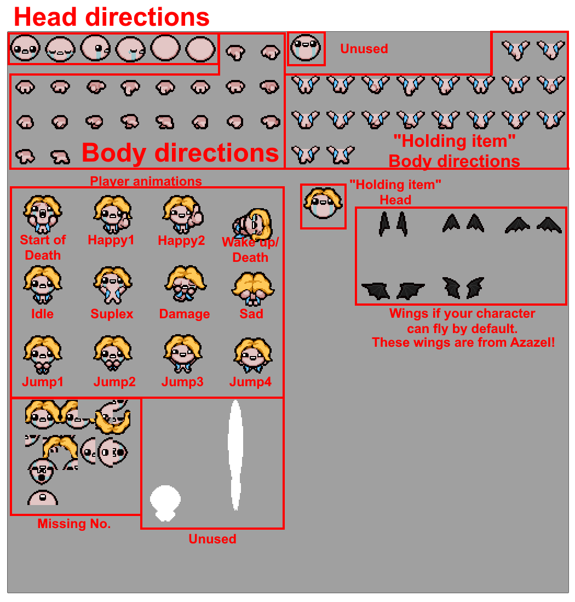
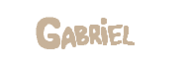
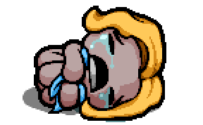
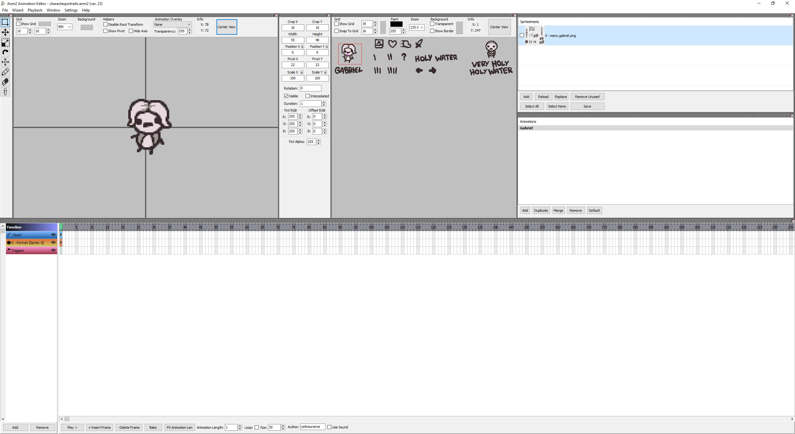
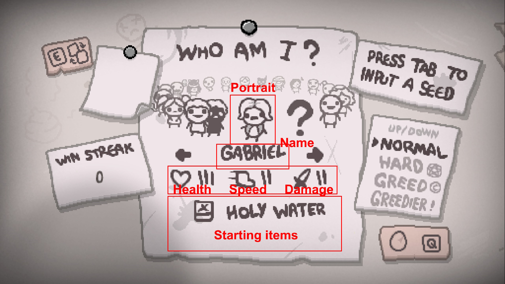
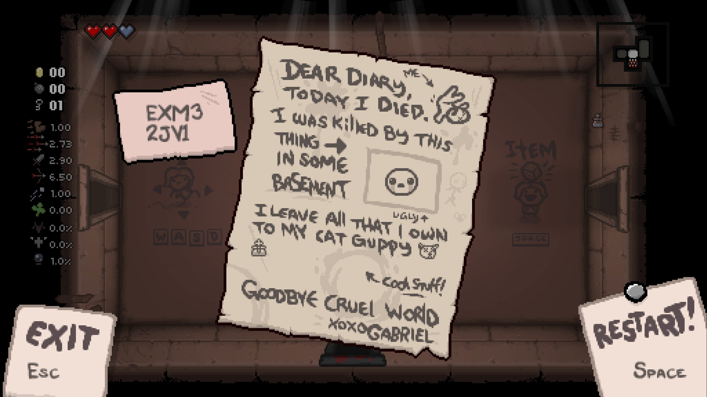
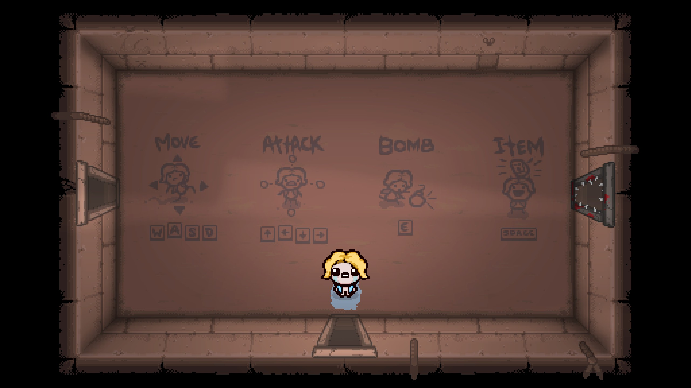



Characters are a core element and main attraction of the Binding of Isaac as a whole. This tutorial will cover how to create your own character and how to play as them yourself.

## Video tutorial
[](https://youtu.be/y38xp-Hw1H0 "Video tutorial")

## Getting the required files
A single character involves numerous files scattered across different folders in your mod. You can download [this template](https://github.com/catinsurance/isaac-character-template) that will have all the required files, which will be referenced throughout this tutorial.

If you wish to reference and use existing files on each character in the vanilla game, they can be located in the game's directory inside `resources/gfx/characters/` (`resources-dlc3` for Repentance content, or `extracted_resources` for Repentance+ users) after [extracting the game's resources](creating_a_mod.md/#extracting-the-games-resources).

## Creating your character
The very first step in creating a character is making an entry for your character in the `players.xml` file. This defines everything about the character such as their name, starting items, health, and spritesheets, as well as many other properties.

```XML
<players root="gfx/characters/costumes/" portraitroot="gfx/ui/stage/" nameimageroot="gfx/ui/boss/">
    <player name="Gabriel"
        skin="character_gabriel.png"
        nameimage="playername_gabriel.png"
        hp="4"
        armor="2"
        keys="1"
        portrait="playerportrait_gabriel.png"
        skinColor="-1"
        items="178"
    />
</players>
```

For every XML file, there is a tag that goes from the start of the file to the end of the file, and multiple "child tags" that act as the individual entries. In this instance, players.xml entries will start with `<players>` and end with `</players>`, while individual character entries are the same but start and end with the `player` tag. Below are explanations of each variable contained within each of these tags.

???- info "root `players` tag variables"
	???+ note
		The variables in the players tag can be changed but should never be removed.
	| Variable Name | Possible Values | Description |
	|:--|:--|:--|
	|root|string|Root path of the character spritesheet. Used with the `skin` variable.|
	|portraitroot|string|Root path of the character portrait for the vs. screen and stage transition screen. Used with the `portrait` variable.|
	|nameimageroot|string|Root path of the character's name for the vs. screen. Used with the `nameimage` variable.|

???- info "`player` tag variables"
	???+ note
		The bare essential variables for creating a character are `name`, `hp`, `skin`, `skinColor`, `nameimage`, and `portrait`. All other variables are optional.
	| Variable Name | Possible Values | Description |
	|:--|:--|:--|
	|name|string|Name of the character (has to match the one in `CharacterMenu.anm2`).|
	|skin|string|Path of the character spritesheet.|
	|skinColor|int|Default skin color of the character (-1 = all, 0 = white, 1 = black, 2 = blue, 3 = red, 4 = green, 5 = grey).|
	|nameimage|string|Name for vs. screen.|
	|portrait|string|Portrait for the vs. screen and for the stage transition screen.|
	|extraportrait|string|.anm2 file that will be displayed on the vs. screen alongside the defined image in the `portrait` attribute.|
	|hp|int|Starting red health (1 = half heart).|
	|armor|int|Starting soul hearts (1 = half soul heart).|
	|black|int|Starting black hearts (1 = half black heart).|
	|items|int|Starting item ID (can separate with a comma to add more than one). Only vanilla items are supported.|
	|trinket|int|Starting trinket ID. Only vanilla trinkets are supported.|
	|costume|int|Costume assigned to the character. Reserved usually for vanilla costumes seen within [this list](https://wofsauge.github.io/IsaacDocs/rep/enums/NullItemID.html), you can use this to add a costume unique to your character. See [Adding a character-specific costume](costumes.md#xml-non-repentogon) for more information.|
	|costumeSuffix|string|Equal to the suffix of a directory to use for character-specific costumes. For example, The Forgotten's costumeSuffix is `_forgotten`, which means that his corresponding directory is located at `resources-dlc3\gfx\characters\costumes_forgotten`.|
	|bombs|int|Starting bombs.|
	|keys|int|Starting keys.|
	|coins|int|Starting coins.|
	|card|int|Starting [card ID](https://wofsauge.github.io/IsaacDocs/rep/enums/Card.html).|
	|pill|int|Starting [pill effect ID](https://wofsauge.github.io/IsaacDocs/rep/enums/PillEffect.html).|
	|canShoot|bool|Set to `false` to disable shooting.|
	|achievement|int|Ties the character to a vanilla achievement.|
	|broken|int|Starting broken hearts.|
	|pocketActive|int|Starting pocket active item ID. Only vanilla active items are supported.|
	|birthright|string|Message when picking up Birthright.|
	|bSkinParent|string|Name of the normal version of your tainted character.|
	|hidden|bool|Set to `true` to hide the character in the character selection screen.|

:modding-repentogon: REPENTOGON adds its own set of `player` tag variables for a wider variety of options on what your character can start with.

???- info ":modding-repentogon: REPENTOGON-exclusive `player` tag variables"
	| Variable Name | Possible Values | Description |
	|:--|:--|:--|
	|items|string|This now supports modded items by using the names of the items instead of the ids. Same format as in vanilla, a comma separated list of values (e.g. `items="My Cool Item,My Second Cool Item"`).|
	|heartcontainers|int|Starting empty heart containers (1 = half container, half heart containers can only be filled halfway).|
	|redhearts|int|Starting red hearts (1 = half heart).|
	|soulhearts|int|Starting soul hearts (1 = half soul heart).|
	|blackhearts|int|Starting black hearts (1 = half black heart). These do not replace soul hearts and are applied **after** soul hearts.|
	|goldenhearts|int|Starting golden hearts (1 = 1 golden heart).|
	|bonehearts|int|Starting empty bone hearts (1 = 1 bone heart).|
	|eternalheart|int|If a character should start with an eternal heart (1 = yes).|
	|brokenhearts|int|Starting broken hearts (1 = 1 broken heart).|
	|rottenhearts|int|Starting rotten hearts (1 = 1 rotten heart).|
	|healthtype|int|The health type the player should start with. The integer corresponds to the [HealthType](https://repentogon.com/xml/achievements.html) enumerator.|
	|healthlimit|int|The maximum amount of HP the character should be able to have. `1 = 1/2 heart`.|
	|speedmodifier|float|An inherent offset to the speed stat the character should start with. Base this offset off of Isaac's stats.|
	|firedelaymodifier|float|An inherent offset to the fire delay stat the character should start with. Base this offset off of Isaac's stats.|
	|damagemodifier|float|An inherent offset to the damage stat the character should start with. Base this offset off of Isaac's stats.|
	|rangemodifier|float|An inherent offset to the range stat the character should start with. Base this offset off of Isaac's stats.|
	|shotspeedmodifier|float|An inherent offset to the shot speed stat the character should start with. Base this offset off of Isaac's stats.|
	|luckmodifier|float|An inherent offset to the luck stat the character should start with. Base this offset off of Isaac's stats.|
	|gigabombs|int|The amount of giga bombs the character should start with. These do not replace normal bombs.|
	|completionparent|string|Used for characters that have shared completion marks with a preexistent character, like Dark Judas and Judas. The name of the parent character should be used for this attribute.|
	|nomarks|bool|If it has any value other than `false`, it will hide the completion marks for the given character.|
	|noshake|bool|Will prevent characters from shaking during stage/boss screen transition (similarly to Keeper) if set to `true`.|
	|achievement|int or string|This is now respected on modded characters. For mods, it's best to define this as the *name* of the achievement (for example, `achievement='TaintedPeter'`, TaintedPeter being the name attribute of the achievement). Characters with this tag should have a second frame in their `characterportraits(alt).anm2` which should be the "locked" picture for the character. In addition, all stat/item layers on the main menu will be hidden and the `Unlocked By` layer will be visible. See the [REPENTOGON achievements XML section](https://repentogon.com/xml/achievements.html) for more info.|
	|modcostume|int|Set this to match the `id` attribute of a costume with `type="none"` defined in the same mod in `costumes2.xml` to have that costume permanantly applied to the character (including during the mineshaft chase sequence). You cannot set both this and the `costume` attribute for vanilla costumes at the same time. See [Adding a character-specific costume](costumes.md#xml-repentogon) for more information.|

## Spritesheets
With the `players.xml` set up, you can now technically play as your new character, but they will have no visuals whatsoever, rendering them invisible apart from their shadow. A majority of the work that goes into a character are their spritesheets.

### In-game sprites
To start, let's go over the necessary spritesheets for your character inside a run:

1. Character spritesheet, located in `gfx/characters/costumes/`. How your character is displayed while playing as them in a run.<br>

2. Name image. Located in gfx/characters/boss/. The name displayed for your character in the vs. screen.<br>

3. Portrait image, located in `gfx/characters/stage/`. The potrait displayed for your character in the vs. screen and the stage transition screen.<br>


Optionally, you may add a costume to your character. This is a separate spriteheet that will display on top of your character, useful if the costume you wish to add to your character's head or body is too big for the original spritesheet. See the [Costumes](costumes.md) tutorial for more information.<br>


### UI sprites
Next are UI sprites for your character. These involve the character selection screen and few other sprites. Unlike the first set of sprites, these will require you create and edit .anm2 files in order to be visible in-game. **All of these sprites are located within `content/gfx/`**.

???+ note
	All of these anm2s will require you create an animation with the name of your character.

1. Character portrait. Uses `characterportraits.anm2`. The portrait you will see when selecting your character on the character selection menu, or when continuing a run while playing as that character.<br>

2. Character name and other attributes. Uses `charactermenu.anm2`. This covers the character's starting health, speed, damage, starting items, and their name on the character selection screen.<br>


3. Co-op menu icon. Uses `coop menu.anm2`. The small icon that will appear when a second player joins your run and is prompted to select a character to join in as.<br>

4. Death name. Uses `death screen.anm2`. The name of your character as it appears on "Isaac's Last Will" when your character dies.


### Controls sprite
Uses `controls.anm2`. A late addition to the Repentance DLC is a unique set of sprites for every character showing how to play as them in the starting room. Many characters will follow the default set of Move, Attack, Bomb, and Item, showing a small doodle of the character performing said actions with the appropriate controls displayed below each section. Other characters have a unique version of this set of controls, replacing "Item" with a unique action related to how the character plays, or even inserting an entirely new doodle exclusive to the character's mechanics. If you do any unique modifications that require the display of a different button to press or moving them around, be sure to edit the anm2's null layers that position the appropriate controls.<br>
???+ note
	The vanilla game's controls sprites can be found in the game's extracted resources in `resources-dlc3/gfx/backdrop/controls.png`.



## Creating a tainted character
Tainted characters are "B-Side" versions of an existing character. These are optional to create, and if left out, the game will display your normal character on both the normal and tainted character menus. If you do wish to create one, they require a specific setup so that they are registered as a tainted version of your normal character,\ with their own set of sprites as opposed to just another character to select.

### `players.xml` changes
When creating a tainted character, the only change you must make to your new character entry is the addition of the `bSkinParent` variable, usually right next to your character's `name`. Here you put the name of normal character you wish to link to your tainted character.

???+ note
	It is recommended to keep your tainted character's name the same as it's normal side. So, if your normal character's name is Gabriel, your tainted version's name should also be Gabriel. This is how it's done in vanilla.

```XML
<players root="gfx/characters/costumes/" portraitroot="gfx/ui/stage/" nameimageroot="gfx/ui/boss/">
    <player name="Gabriel"
        skin="character_gabriel.png"
        nameimage="playername_gabriel.png"
        hp="4"
        armor="2"
        keys="1"
        portrait="playerportrait_gabriel.png"
        skinColor="-1"
        items="178"
    />

    <player name="Gabriel"
        skin="character_gabriel_b.png"
        nameimage="playername_gabriel.png"
        hp="4"
        armor="2"
        keys="1"
        portrait="playerportrait_gabriel_b.png"
        skinColor="-1"
        bSkinParent="Gabriel"
        costumeSuffix="gabrielb"
        costume="104"
    />
</players>
```

### Content anm2 files
Inside `content/gfx`, when making a tainted character, you will need to copy and rename several anm2s so that the game knows they're for tainted characters. Below is a list of all the available files you can rename and edit:

|Original ANM2 name|Tainted ANM2 name|
|:--|:--|
|charactermenu.anm2|charactermenualt.anm2|
|characterportrait.anm2|characterportraitalt.anm2|
|controls.anm2|controls alt.anm2|
|coop menu.anm2|coop menu alt.anm2|
|death screen.anm2|death screen alt.anm2|