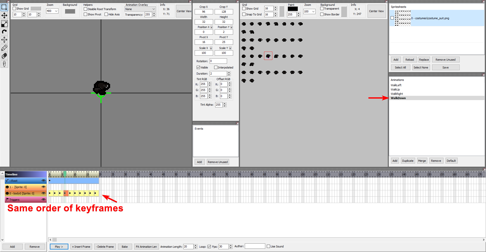
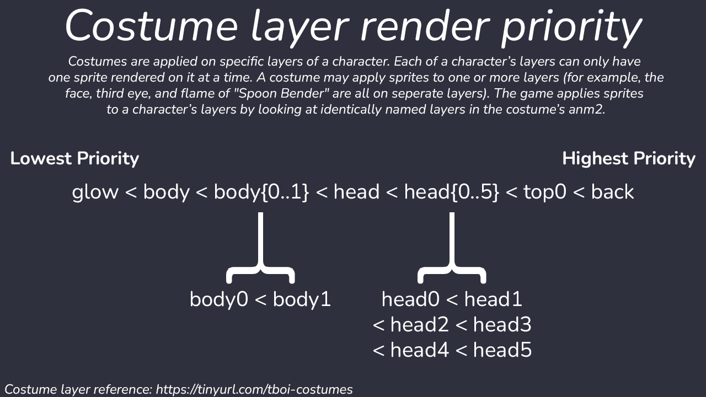



Costumes are the extra layers of sprites that are added onto Isaac to change his appearance. Costumes can be given from items, characters, and even directly under some circumstances. This tutorial will cover how to create and add your own custom costumes.

## Creating a costume
All costumes require a `.anm2` file. When creating your costume, it is easiest to reference, copy, or modify an existing costume from the game, as it will already have all the layers and frames laid out for you. For example, if you're trying to make a costume that gives Isaac a hat, you could reference something like Black Candle's costume (located in `resources/gfx/characters/260_blackcandle.anm2`). You can find costume `.anm2` files inside `resources/gfx/characters/` after [extracting the game's resources](creating_a_mod.md/#extracting-the-games-resources).

Each animation in a costume corresponds to an animation in the player `.anm2` file (`resources/gfx/001.000_player.anm2`). Each keyframe in this animation corresponds to that keyframe of the player. For example, if creating a costume that affects Isaac's body, you will want to create animations for each directional walk animation in the player `.anm2` file, and copy the keyframes from those.



### Costume layers
All of the game's costumes work via **layers**. A costume can occupy one or more layers, though each layer can only hold one spritesheet at a time. There are a total of **15 layers**, although mods can only use 13 of these. Additionally, there is a set order of when each layer is rendered. Below is the list of layers that mods can use in order of render priority, from being rendered first to last (layers rendered first will appear *behind* layers rendered last):



???- info "Layer render priority"
	| Layer name | Description |
	|:--|:--|
	|glow|Rendered behind the head. Used for glowing auras, such as with items like Mysterious Liquid|
	|body|Directly replaces Isaac's body|
	|body0|Rendered over the body|
	|body1|Rendered over the body|
	|head|Directly replaces Isaac's head|
	|head0|Usually character-specific costumes (e.g. Magdalene's hair)|
	|head1|Rendered over the head|
	|head2|Rendered over the head|
	|head3|Rendered over the head|
	|head4|Rendered over the head|
	|head5|Rendered over the head|
	|top0|Used for wing costumes when walking upwards. Attached to the body's direction, but renders above the head|
	|back|Attached to the head. Exclusively used by the Venus costume for the back view of the hair. Best seen with a costume that removes the body|

[You can find a spreadsheet documenting every costume and the layers they occupy by clicking here.](https://docs.google.com/spreadsheets/d/1NGa3IARRSvs5XF9lxbYWFnbI77xO1m2YYaKEoB6OyVI/edit?gid=0#gid=0)

A costume can have any combinations of these layers. Any layers not a part of this list will not appear on Isaac.

If two costumes that occupy the same layer are added onto Isaac, only the one with the highest `priority` will be rendered. If two costumes of equal priority occupy the same layer, then only the one that was added most recently will render. Priorities are defined in the `costumes2.xml` file.

If a costume with more than one layer has one of its layers conflicting with another costume and is of the lower priority, the other layers will still be rendered, allowing for a unique mismatch of different sprites on multiple layers.

### Animated costumes
Animated costumes can be done by adding `_Idle` after the animation name. The animation restarts from the first frame when switching to a different animation (e.g. `HeadRight_Idle` to `HeadDown_Idle`). Make sure to check the *loop* box at the bottom of the animation editor in order for your animation to loop. Standard layer rendering priority still applies, so you can have an animated `head0` layer while having a static `head4` layer.

You can also add `_Overlay` after the animation name to animate on top of the player's animation instead of replacing it. For example, `HeadDown_Overlay` animates on top of the player's `HeadDown` animation, while `HeadDown_Idle` *replaces* the player's `HeadDown` animation.

Some costumes, like the second form of the Wavy Cap costume (`resources/gfx/characters/029x_wavycap2.anm2`), have both an overlay *and* an idle animation.

<p align="center">
  
</p>

## Adding a costume
All costumes entries are defined in a [costumes2.xml](https://wofsauge.github.io/IsaacDocs/rep/xml/costumes2.html) file, located in the `content` folder at the root of your mod folder. In this folder, there must be a root `costumes` tag. This tag has an `anm2root` property, which should point to the root directory of where your costumes are stored, usually `gfx/characters/`.

```xml
<costumes anm2root="gfx/characters/">

</costumes>
```

When defining a costume inside of a `costumes` root tag, your `costume` is required to have at least a `anm2path` property and a `type` property.

- The `anm2path` tag holds the path to your costume, starting from the `anm2root` property in the root `costumes` tag.
- The `type` tag tells the game what type of costume you're creating. There are 5 types of costumes:
	- `passive` costumes will be added when a passive item is added to Isaac's inventory (after Isaac is done holding it over his head), and will be removed automatically if the passive item is lost.
	- `familiar` costumes function the same as `passive` costumes, but for items defined as familiars in `items.xml`.
	- `active` costumes will be added when an active item is used, and will be removed automatically upon entering a new room.
	- `trinket` costumes will be added when a trinket is added to Isaac's inventory (after Isaac is done holding it over his head), and will be removed automatically if the trinket is dropped.
	- `none` costumes are known as "null costumes", and must be applied manually through code.

```xml
<costumes anm2root="gfx/characters/">
    <costume anm2path="some_passive_costume.anm2" type="passive" />
    <costume anm2path="some_familiar_costume.anm2" type="familiar" />
    <costume anm2path="some_active_costume.anm2" type="active" />
    <costume anm2path="some_trinket_costume.anm2" type="trinket" />
    <costume anm2path="some_null_costume.anm2" type="none" />
</costumes>
```

???- info "Applying null costumes"
	To apply a null costume, you must get its ID using [`Isaac.GetCostumeIdByPath("filePath")`](https://wofsauge.github.io/IsaacDocs/rep/Isaac.html#getcostumeidbypath), and apply it on the player with [`EntityPlayer:AddNullCostume(costumeId)`](https://wofsauge.github.io/IsaacDocs/rep/EntityPlayer.html#addnullcostume).

	**Additionally, `Isaac.GetCostumeIdByPath` will return `-1` if the costume's path isn't defined in `costumes2.xml`. Attempting to add a costume with an ID of -1 or any ID that doesn't correlate to an existing costume will cause the game to crash.**

	```lua
	-- At the top of your Lua file...
	local costumeId = Isaac.GetCostumeIdByPath("gfx/characters/some_null_costume.anm2")

	-- Somewhere else in your code...
	local player = Isaac.GetPlayer(0)
	player:AddNullCostume(costumeId)
	```

There are some additional properties you can add to your `costume` tag for extra customization.

- `priority` defines the priority of the costume if it were to have a layer than conflicts with a different costume's layer (see [costume layers](#costume-layers)).
- `overwriteColor` defines if a costume should override the player's **skin color** with the `skinColor` property.
- `skinColor` defines [the id](https://wofsauge.github.io/IsaacDocs/rep/enums/SkinColor.html) of the skin color that the player's skin will be changed to.
- `hasSkinAlt` defines if a costume has alternate spritesheets depending on the **skin color** of the player. These spritesheets should be in the same folder as the original spritesheet, but with a different suffix to its file name. This suffix correspond to the skin color the spritesheet is for. The skin colors are `_black`, `_blue`, `_green`, `_grey`, `_red`, and `_white` (example: a spritesheet at `gfx/characters/costumes/face.png`, with an alternate spritesheet for the red skin color at `gfx/characters/costumes/face_red.png`).
- `forceBodyColor` defines if a costume will always force the body color to be the defined skin color.
- `forceHeadColor` defines if a costume will always force the head color to be the defined skin color.
- `isFlying` defines if the costume is meant for something that grants flight.
- `hasOverlay` defines is a costume is using an **overlay effect**, also known as an [animated costume](#animated-costumes).

### Adding a character-specific costume replacement
Some characters have unique head shapes or faces, and may require alternate spritesheets for certain costumes in order to make them look natural. These character-specific variants are added through **costume suffix folders**.

Inside your costumes folder (usually `resources/gfx/characters/`), you can create a folder that houses these costumes for your character. The folder should start with the name `"costume_"`, and end with a suffix defined in [`players.xml`](https://wofsauge.github.io/IsaacDocs/rep/xml/players.html?). Either define `costumeSuffix` in your character's `players.xml` entry (e.g. `costumeSuffix="mycharacter"`), or use an existing suffix from the vanilla characters. The complete folder name should look something like "`costumes_mycharacter`". For reference, the existing vanilla suffixes are:

- shadow (Dark Judas, Tainted Judas)
- lilith
- keeper
- apollyon
- forgotten
- forgottensoul
- lilithb

Within your costume suffix folder, place your alternate `.png` file with the exact same name as the spritesheet you wish to replace. The game will automatically use this spritesheet instead of the default one.


## Adding a character-specific costume
Custom characters use a costume in order to have a different default appearance than Isaac. For example, Cain has a costume for his eyepatch. There are 3 ways to add a costume such that it will only appear on your own custom character.

### Lua
[As mentioned earlier](#adding-a-costume), you can set up your costume to be a null costume and add it through code. You can add your costume under the `MC_POST_PLAYER_INIT` callback for when your player initializes, and for extra safety, on `MC_POST_NEW_ROOM` in case it was accidentally removed.

???+ warning "Warning"
	Costumes added this way are not protected from being removed by the Mother's Shadow escape sequence, or by things which reroll your items, such as the D4.

```lua
local mod = RegisterMod("My Mod", 1)
local MY_PLAYER = Isaac.GetPlayerTypeByName("My Character", false)
local MY_COSTUME = Isaac.GetCostumeIdByPath("gfx/characters/my_costume.anm2")

function mod:AddPlayerCostume(player)
	--Check by PlayerType, not name, to ensure it's our character
	if player:GetPlayerType() == MY_PLAYER then
		--Add the costume
		player:AddNullCostume(MY_COSTUME)
	end
end

function mod:AddCostumeOnNewRoom()
	--Most reliable way to search through players in the room
	for _, ent in ipairs(Isaac.FindByType(EntityType.ENTITY_PLAYER)) do
		--Isaac.FindByType passes an Entity. Turn it into an EntityPlayer to use player-specific functions
		local player = ent:ToPlayer()
		--Call the function above that already has the code we want
		mod:AddPlayerCostume(player)
	end
end

--The 0 here is for actual players, so not co-op babies, but still including co-op ghosts
mod:AddCallback(ModCallbacks.MC_POST_PLAYER_INIT, mod.AddPlayerCostume, 0)
mod:AddCallback(ModCallbacks.MC_POST_NEW_ROOM, mod.AddCostumeOnNewRoom)
```

### XML (Non-REPENTOGON)
Using XML to add a costume will ensure it will never be removed by rerolls, or by the Mother's Shadow escape sequence. Vanilla characters get around this by adding a `costume` property with the ID of the costume that the character should have. Because modded costumes do not have IDs, the only solution to this is to use one of vanilla game's player-specific costumes that has the appropriate layers we need, and to replace its spritesheet in our character's [costume suffix folder](#adding-character-specific-costume-replacements).

Inside the `players.xml` file where you have your custom character defined, add the `costume` property and set it to an existing vanilla null costume. You can get a good idea of the IDs of each null costume through the [NullItemID](https://wofsauge.github.io/IsaacDocs/rep/enums/NullItemID.html) enumeration, or by looking in the `costumes2.xml` folder inside the game's extracted resources.

In this example, we will make a custom costume for our character's hair that uses Flipped Tainted Lazarus' costume as a base, as this costume is never added to other characters in the game through normal means.

```xml
<players root="gfx/characters/costumes/"
         portraitroot="gfx/ui/stage/"
         nameimageroot="gfx/ui/boss/">
	<player name="My Character" skin="character_mycharacter.png"
			hp="6"
			nameimage="playername_mycharacter.png"
			portrait="playerportrait_mycharacter.png"
			costume="34"
			costumeSuffix="mycharacter"
			birthright="???" />
</players>
```

Next, we'd create an alternate spritesheet based off of `resources/gfx/characters/character_009b_lazarus2hair.png`, and put that in our costumes suffix files (e.g. `costumes_mycharacter`).

### XML (REPENTOGON)
:modding-repentogon: REPENTOGON adds a method to add your own costume through the `modcostume` property you can add to your character inside `players.xml`.

First, define a null costume in `costumes2.xml`. **Unlike for normal null costumes, you'll need to set an ID!** This will not overlap with IDs from costumes of other types (passive, familar, active, trinket), or from other mods.

```xml
<!-- costumes2.xml -->
<costumes anm2root="gfx/">
    <costume id="0" anm2path="characters/some_null_costume.anm2" type="none" />
</costumes>
```

Then, add `modcostume` to your character's `players.xml` entry, and set it to the ID you defined for the costume.

```xml
<!-- players.xml -->
<players root="gfx/characters/costumes/"
         portraitroot="gfx/ui/stage/"
         nameimageroot="gfx/ui/boss/">
	<player name="My Character" skin="character_mycharacter.png" hp="6"
			nameimage="playername_mycharacter.png"
			portrait="playerportrait_mycharacter.png" modcostume="0"
			birthright="???" />
</players>
```