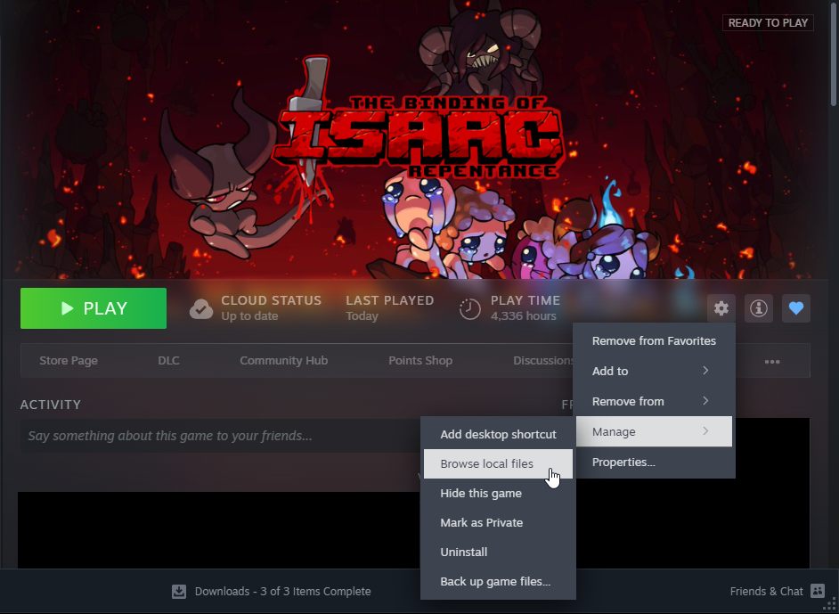

---
tags:
    - Tutorial
    - Beginner friendly
    - No Lua
    - Video
    - Repentance
    - Repentance+
authors:
    - catinsurance
---

# Creating a mod
This tutorial will cover the creation of a basic Isaac mod that replaces a sprite. This tutorial assumes you're using Windows, although the process is largely the same on Linux machines.

## Video tutorial

## Making your mod's folder
In Repentance and Repentance+, all mods are stored in your `mods` folder, located in the game's directory. To find the game's directory, you can click the gear icon on the game in your library on Steam, hover over "Manage", then click "Browse local files".

Inside of your `mods` folder, create a new folder. You can name this anything. Launching the game will put a file named `metadata.xml` into your new mod's folder. This folder holds the name of your mod in the mods list.

The mods list is sorted by load order, and the load order is determined by the placement of your mod alphabetically. So mods with symbols at the beginning of their name will be placed at the top of the list, and therefore are loaded first.

You can change the text within the `name` tag here. The description can be set when you upload the mod to the Steam Workshop. Additionally, other tags may appear in this file after uploading the mod.

This is technically all you need to do to create a mod. The rest of the tutorial will be focused on creating a basic resprite mod.

## Extracting the game's resources
To replace a sprite (or any asset in the game), you must place a file in your mods folder that mirrors the file path of what you're trying to replace, whether that be an item sprite or a sound. In this tutorial, we'll be focusing on replacing the D6, but first we need to know where the D6 is stored in the game's file structure in order to replicate that within our mod.

Open the game's directory as we did before, and open the `tools` folder. Within the `tools` folder, open the `ResourceExtractor` folder. Double-clicking `ResourceExtractor.exe` will run the resource extraction program. This may take a while, so wait for it to complete its process.

The place the game's files will extract to depend on what DLC of the game you have enabled.

**For Repentance users,** check the game's directory. You will find a `resources` folder, as well as multiple folders deriving the name `resources-dlc3`. Content added in the Repentance DLC will be found in the `resources-dlc3` folder, with content for other languages found in one of the other `resources-dlc3` folders (for example, Japanese resources can be found in `resources-dlc3.jp`). All other content will be found in the `resources` folder, including some sprites that were changed in the Repentance DLC.

**For Repentance+ users,** find the new `extracted-resources` folder within the game's directory. Here you will find a `resources` folder, as well as other `resources` folders for different translations of the game. In Repentance+, the `resources-dlc3` and `resources` folders were merged, meaning most assets in the game can now be found in the `resources` folder.

## Replacing assets with your mod
Now that we have extracted the game files, we can get to replacing the D6's sprite in our mod.

First, we must find where the D6's sprite is located in the game's file structure. It can be found at this path within the `resources` folder:
`gfx/items/collectibles/collectibles_105_dice.png`

Now we must mimic this same file structure within our mod. Go back to your mod's folder and create a folder named `resources`. Within this folder, create a folder name `gfx`, then within that a folder named `items`, then `collectibles`, then finally place the sprite in there with the exact same name as the sprite you're replacing (in this case, `collectibles_105_dice.png`). **Keep in mind that this is cAsE-sEnSiTiVe!**

???+ warning "Warning"
    When replacing images, you must make sure your image is encoded in 32-bit, and is a PNG. [Aseprite](https://www.aseprite.org/) handles this by default. Otherwise, you must find out how to configure this in the art progarm of your choice.

After adding new resources to your mod, make sure you restart your game to see the changes.