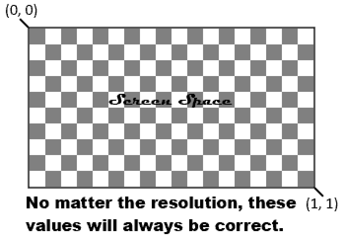



Shaders are powerful tools that allow for the creation of many visual effects that would otherwise be much harder or even impossible to implement.

This tutorial covers some shader basics to help you understand what shaders are actually doing under the hood.

## Introduction

Shaders provide a set of instructions to the graphics card that specify information related to rendering.
Unlike other aspects of Isaac modding, **shaders are not programmed in Lua**. It is therefore *recommended* that you have prior experience with programming, or are willing to look into the specifications of the [GLSL Programming Language](https://www.khronos.org/opengl/wiki/Core_Language_(GLSL)), which Isaac uses for writing shaders.

??? note "Technical Information"
    At their core, shaders are just a way of sending instructions to the graphics card. Though only fragment and vertex type shaders can be written for Isaac modding, different types of shaders are used in other applications for more advanced techniques, such as parallel processing.

    You can learn more about shaders and their applications [here](https://www.khronos.org/opengl/wiki/shader).

GLSL is very similar to C-like languages, with a few key differences such as [swizzling](https://www.khronos.org/opengl/wiki/Data_Type_(GLSL)#Swizzling) and (something else I'll remember later), but if you are comfortable working in C or any languages like it, it may be easy enough to work with. It is important to note that this is not a GLSL tutorial, and it will assume that you have a baseline understanding of it or any other C-based languages. Check the [resources](./shader_resources.md) section for learning resources for GLSL.

## Getting Started

To start writing a custom shader, simply create a ``shaders.xml`` file within your mod's ``content`` folder. An empty example shader file can be found [here](./assets/shader_basics/shaders.xml).

If opening this up seems a bit daunting at first, do not worry, we will cover all of this information in detail below.

## Breaking It All Down

Below is the anatomy of a ``shaders.xml`` file:

```xml
<!-- 
 First, we provide a shader definition. 
 The shader's name will be used to reference it in-game.
 -->
<shader name="myShader">
    <!-- 
         Next, we can choose to provide some shader parameters. 
         These are values you can provide to the shader
         using the MC_GET_SHADER_PARAMS callback in-game.
         
         Here are some examples of possible parameters:
    -->
    <parameters> 
        <!-- The type float can be used to input a number into your shader. -->
        <param name="myVariable1" type="float">
        <!-- The type vec2 can be used to provide a standard 2D vector. -->
        <param name="myVariable2" type="vec2">
        <!-- Likewise, but a 3D vector. -->
        <param name="myVariable3" type="vec3">
        <!-- And finally, a 4D vector. -->
        <param name="myVariable4" type="vec4">
    </parameters>

    <!-- 
     Finally, a Vertex and Fragment form. 
     These will be explained in further detail below. 
    -->
    <vertex> ... </vertex>
    <fragment> ... </fragment>
</shader>
```

Before worrying about parameters, we must first understand how a shader works. A shader works in two parts, a **fragment** and a **vertex** shader. As the Vertex shader is *not as important* (asterisk, but we'll get there), we will start with the Fragment shader:

```glsl
// A color "tint" variable.
varying lowp vec4 Color0;

// A normalized coordinate variable.
varying mediump vec2 TexCoord0;

// Information about the render screen (which will be explained later).
varying lowp vec4 RenderDataOut;

// Information about the render scale.
varying lowp float ScaleOut;

// A sample of the screen's image.
uniform sampler2D Texture0;

/* 
    All aforementioned variables are provided by the game.
    Failure to include them in your shader may cause issues.

    More information is available below this code snippet.
*/

// The main function, where you would write your code.
void main(void)
{
    // A base color value, getting the color of the current pixel
    vec4 Color = Color0 * texture2D(Texture0, TexCoord0);

    // gl_FragColor, which returns the color to the screen 
    gl_FragColor = Color;
}
```

The fragment shader's job is simply to output a color. It does this for every pixel of the screen. The ``sampler2D`` parameter is automatically provided to the shader with a sample of the screen's image. It samples the image using the built in ``texture2D`` function that intakes ``TexCoord0`` as the position of the shader. All of these parameters are **automatically provided by the game.**

??? note "Technical Information"
    Fragment shaders don't *always* run on every single pixel. This is only true because the shaders we are trying to make affect screenspace. 
    
    With :modding-repentogon: [REPENTOGON](https://repentogon.com/), it is possible to create shaders that affect only a specific sprite or area instead of the whole screen, but they are outside the scope of shader basics.

The notable thing about ``TexCoord0`` is that it is a normalized 2D Vector. This means its values will only ever range from **0 to 1** in both directions.



Other provided values include ``Color0``, which for screen-space shaders should always be white with full alpha. GLSL Color values are ``vec4``, comparable to that of the [Color class the game uses](https://wofsauge.github.io/IsaacDocs/rep/Color.html), where values are ``(R, G, B, A)``.

Finally, the ``gl_FragColor`` value returns whatever color it is set to as the output for the current pixel. It is reserved by the shader, and will always be the output value of the pixel.

??? warning
    A fragment shader must **always** set ``gl_FragColor``. Not doing so will lead to unexpected results that differ between graphics cards.

    These effects can range from doing nothing and defaulting to black, to seizure inducing rapid color flashes depending on the graphics card.